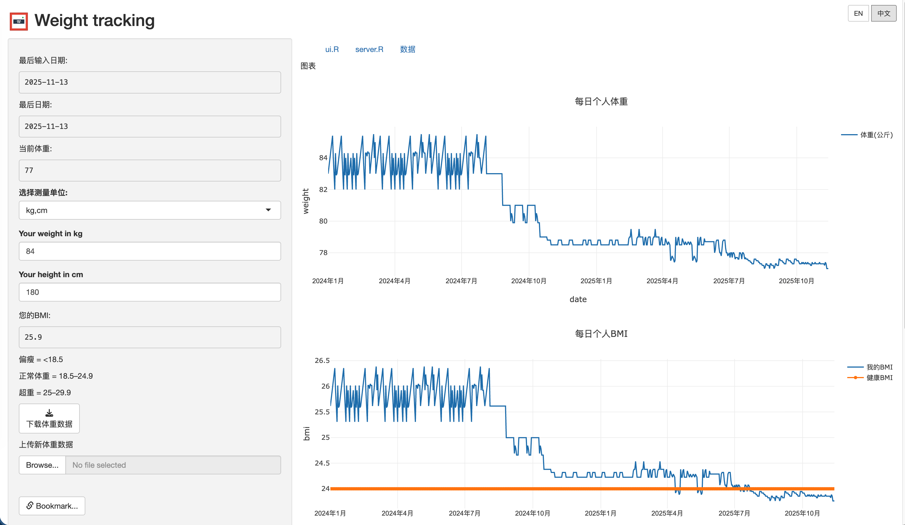
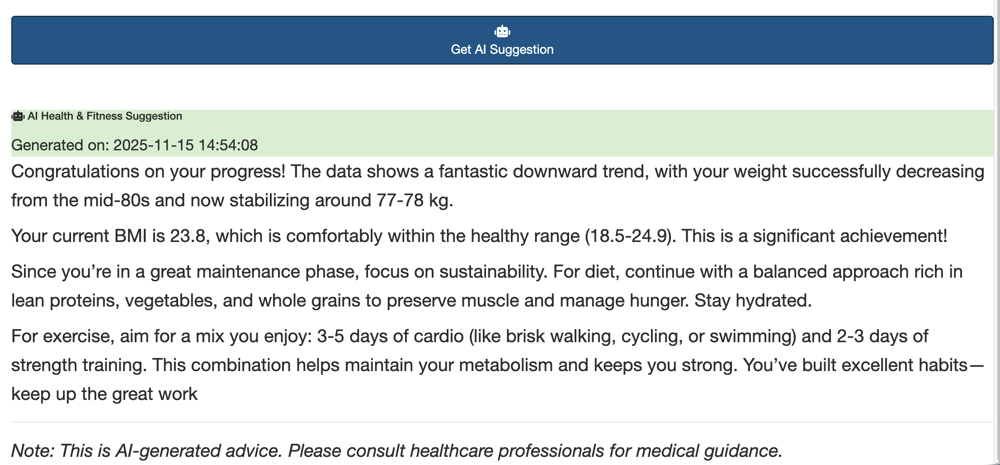

[English](README.md) | [中文](_README_CN.md)

# Weight Tracking Shiny App

A comprehensive personal weight and BMI tracking web application built with R Shiny, featuring AI-powered health suggestions. This interactive dashboard helps you monitor your weight trends, calculate BMI, maintain comprehensive fitness records, and receive personalized health advice.








## Live Demo

https://jcflyingco.shinyapps.io/weight_tracking/


## 🌟 Features

### **Core Functionality**
- **Interactive Weight Tracking**: Log and visualize your weight over time with interactive Plotly charts
- **BMI Calculator**: Automatically calculate BMI with real-time updates and comparison against healthy ranges
- **Unit Conversion**: Switch seamlessly between metric (kg, cm) and imperial (pounds, inches) units
- **Data Management**: Download your data as Excel files and upload new measurements
- **Real-time Updates**: Automatic data refresh when Excel files are modified
- **URL Bookmarking**: Share specific views and states via generated URLs
- **Multi-language Support**: Full internationalization with English and Chinese language switching

### **🤖 AI-Powered Health Suggestions**
- **Multiple AI Providers**: Choose from Modelscope, OpenRouter, Gemini, or OpenAI-compatible APIs
- **Dynamic Provider Selection**: Switch between AI providers with automatic URL and model updates
- **Personalized Advice**: Get health and fitness suggestions based on your recent weight trends
- **Markdown Formatting**: AI responses display with proper formatting and professional styling
- **Error Handling**: Graceful fallbacks and helpful troubleshooting messages

### **User Interface**
- **Responsive Design**: Clean, user-friendly interface that works on desktop and mobile
- **Tab-based Navigation**: Organized interface with plots, code viewing, and data table tabs
- **Interactive Charts**: Hover effects, zoom, and pan capabilities on weight and BMI trends
- **Professional Styling**: Modern card-based layouts with Bootstrap components
- **Language Switching**: Easy toggle between English and Chinese languages
- **Localized Charts**: Date formatting and chart labels adapt to selected language


## 🚀 Getting Started

### Prerequisites

- R (version 4.0 or higher recommended)
- Required R packages (see below)

### Installation

1. **Clone this repository:**

   ```bash
   git clone https://github.com/yourusername/weight-tracking-shiny.git
   cd weight-tracking-shiny
   ```

2. **Install required R packages:**

   ```r
   # Core dependencies
   install.packages(c("shiny", "tidyverse", "readxl", "plotly", "anytime",
                      "bslib", "DT", "rsconnect", "markdown"))

   # UI/UX enhancements
   install.packages(c("shinyalert", "shinyjs", "shinydashboard",
                      "shinydashboardPlus", "shinyWidgets"))

   # Data processing and AI integration
   install.packages(c("openxlsx", "readr", "rvest", "curl", "httr", "RCurl", "ellmer"))
   ```

   **Alternative: Quick Installation Script**
   ```bash
   Rscript -e "
   install.packages(c('shiny', 'tidyverse', 'readxl', 'plotly', 'anytime',
                      'bslib', 'DT', 'rsconnect', 'markdown', 'shinyalert',
                      'shinyjs', 'shinydashboard', 'shinydashboardPlus',
                      'shinyWidgets', 'rvest', 'curl', 'httr', 'RCurl', 'ellmer'))
   cat('✓ All packages installed successfully\n')
   "
   ```

3. **Run the application:**

   ```r
   # Method 1: Using R console
   shiny::runApp()

   # Method 2: Using command line
   R -e "shiny::runApp()"

   # Method 3: Run on specific port (useful for deployment)
   R -e "shiny::runApp(host='0.0.0.0', port=3838)"
   ```

## 🤖 AI Configuration

### Setting Up AI Suggestions

1. **Choose an AI Provider:**
   - **Modelscope**: Default provider with models like `zhipuAI/GLM-4.6`
   - **OpenRouter**: Alternative provider with various AI models
   - **Gemini**: Google's AI models
   - **OpenAI-compatible**: Custom OpenAI-compatible endpoints

2. **Configure API Key:**
   - Select your preferred AI provider from the dropdown
   - Enter your API key in the configuration panel
   - Choose your preferred model (first model selected by default)

3. **Get AI Suggestions:**
   - Click "Get AI Suggestion" to receive personalized health advice
   - AI analyzes your recent weight trends and provides tailored recommendations
   - Suggestions display in a formatted card with professional styling

## 🛠️ Project Structure

```
weight-tracking-shiny/
├── ui.R                 # User interface definition with AI configuration and language switching
├── server.R             # Server-side logic, AI integration, calculations, and language management
├── global.R             # Global settings and bookmarking configuration
├── ai_config.R          # AI provider configuration and management
├── language.R           # Internationalization system (English/Chinese translations)
├── weight shiny.Rproj   # RStudio project file
├── weight.xlsx          # Sample data file (you can replace this)
├── logo.png             # Application icon (optional)
├── README.md            # This file
├── CLAUDE.md            # Development guide for AI assistants
└── rsconnect/           # Deployment configuration directory
```


## 🚀 Deployment

### ShinyApps.io

The app is configured for deployment to ShinyApps.io:

1. **Install rsconnect:**
   ```r
   install.packages("rsconnect")
   ```

2. **Configure your account:**
   ```r
   rsconnect::setAccountInfo(name='youraccount', token='YOUR_TOKEN', secret='YOUR_SECRET')
   ```

3. **Deploy:**
   ```r
   rsconnect::deployApp()
   ```


### Adding New AI Providers

1. **Edit `ai_config.R`:**
   ```r
   new_provider = list(
     provider_url = "https://api.example.com/v1",
     models = c("model1", "model2")
   )
   ```

2. **Update UI choices:**
   ```r
   choices = c("modelscope" = "modelscope", "new_provider" = "new_provider")
   ```

### Adding New Languages

1. **Edit `language.R`:** Add new language entry to the `translations` list
2. **Update UI:** Add new language button in `ui.R` (around lines 35-40)
3. **Add Server Observers:** Add language switching observers in `server.R`
4. **Test Implementation:** Verify all UI elements render correctly

Example language addition:
```r
# In language.R
translations <- list(
  # ... existing languages
  es = list(
    app_title = "Seguimiento de peso",
    # ... more Spanish translations
  )
)
```

### Customizing AI Prompts

Modify the AI suggestion prompt in `server.R` around lines 476-533 to customize the type of health advice provided. Note that prompts are language-specific.


