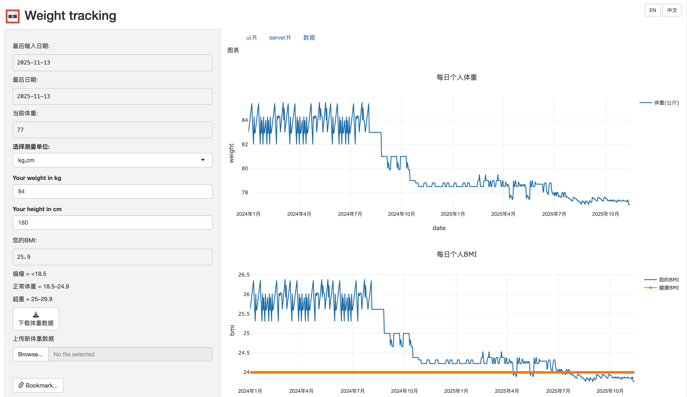
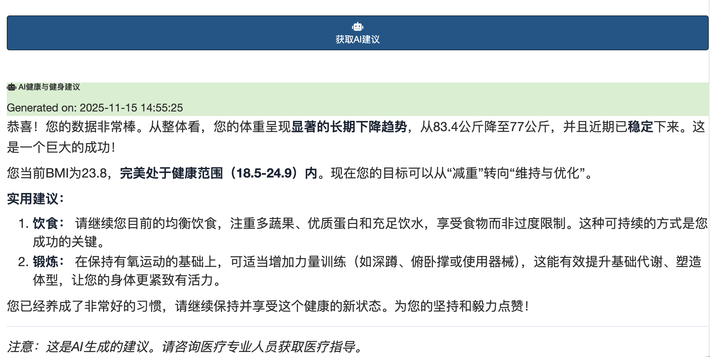

[English](README.md) | [中文](_README_CN.md)

# 体重追踪 Shiny 应用

一个基于 R Shiny 构建的综合个人体重和BMI追踪网络应用程序，具有AI驱动的健康建议功能。这个交互式仪表板帮助您监控体重趋势、计算BMI、维护全面的健身记录，并接收个性化的健康建议。







## 在线演示

https://jcflyingco.shinyapps.io/weight_tracking/


## 🌟 功能特性

### **核心功能**
- **交互式体重追踪**: 通过交互式Plotly图表记录和可视化您的体重随时间变化
- **BMI计算器**: 自动计算BMI，实时更新并与健康范围比较
- **单位转换**: 在公制（公斤，厘米）和英制（磅，英寸）单位之间无缝切换
- **数据管理**: 将数据下载为Excel文件并上传新的测量数据
- **实时更新**: 当Excel文件被修改时自动刷新数据
- **URL书签**: 通过生成的URL分享特定视图和状态
- **多语言支持**: 完整的国际化，支持英文和中文语言切换

### **🤖 AI驱动的健康建议**
- **多个AI提供商**: 选择Modelscope、OpenRouter、Gemini或OpenAI兼容的API
- **动态提供商选择**: 在AI提供商之间切换，自动更新URL和模型
- **个性化建议**: 基于您最近的体重趋势获取健康和健身建议
- **Markdown格式化**: AI响应以适当的格式和专业样式显示
- **错误处理**: 优雅的回退和有用的故障排除消息

### **用户界面**
- **响应式设计**: 适用于桌面和移动设备的清洁、用户友好界面
- **标签页导航**: 有组织的界面，包含图表、代码查看和数据表格标签页
- **交互式图表**: 体重和BMI趋势的悬停效果、缩放和平移功能
- **专业样式**: 使用Bootstrap组件的现代卡片布局
- **语言切换**: 在英文和中文之间轻松切换
- **本地化图表**: 日期格式和图表标签适应所选语言


## 🚀 入门指南

### 前提条件

- R（推荐4.0或更高版本）
- 所需的R包（见下文）

### 安装

1. **克隆此仓库:**

   ```bash
   git clone https://github.com/yourusername/weight-tracking-shiny.git
   cd weight-tracking-shiny
   ```

2. **安装所需的R包:**

   ```r
   # 核心依赖
   install.packages(c("shiny", "tidyverse", "readxl", "plotly", "anytime",
                      "bslib", "DT", "rsconnect", "markdown"))

   # UI/UX增强
   install.packages(c("shinyalert", "shinyjs", "shinydashboard",
                      "shinydashboardPlus", "shinyWidgets"))

   # 数据处理和AI集成
   install.packages(c("openxlsx", "readr", "rvest", "curl", "httr", "RCurl", "ellmer"))
   ```

   **替代方案: 快速安装脚本**
   ```bash
   Rscript -e "
   install.packages(c('shiny', 'tidyverse', 'readxl', 'plotly', 'anytime',
                      'bslib', 'DT', 'rsconnect', 'markdown', 'shinyalert',
                      'shinyjs', 'shinydashboard', 'shinydashboardPlus',
                      'shinyWidgets', 'rvest', 'curl', 'httr', 'RCurl', 'ellmer'))
   cat('✓ 所有包安装成功\n')
   "
   ```

3. **运行应用程序:**

   ```r
   # 方法1: 使用R控制台
   shiny::runApp()

   # 方法2: 使用命令行
   R -e "shiny::runApp()"

   # 方法3: 在特定端口运行（适用于部署）
   R -e "shiny::runApp(host='0.0.0.0', port=3838)"
   ```

## 🤖 AI配置

### 设置AI建议

1. **选择AI提供商:**
   - **Modelscope**: 默认提供商，提供如`zhipuAI/GLM-4.6`等模型
   - **OpenRouter**: 备选提供商，提供各种AI模型
   - **Gemini**: Google的AI模型
   - **OpenAI兼容**: 自定义OpenAI兼容端点

2. **配置API密钥:**
   - 从下拉菜单中选择您偏好的AI提供商
   - 在配置面板中输入您的API密钥
   - 选择您偏好的模型（默认选择第一个模型）

3. **获取AI建议:**
   - 点击"获取AI建议"接收个性化健康建议
   - AI分析您最近的体重趋势并提供量身定制的建议
   - 建议在格式化卡片中显示，具有专业样式

## 🛠️ 项目结构

```
weight-tracking-shiny/
├── ui.R                 # 用户界面定义，包含AI配置和语言切换
├── server.R             # 服务器端逻辑、AI集成、计算和语言管理
├── global.R             # 全局设置和书签配置
├── ai_config.R          # AI提供商配置和管理
├── language.R           # 国际化系统（英文/中文翻译）
├── weight shiny.Rproj   # RStudio项目文件
├── weight.xlsx          # 示例数据文件（您可以替换此文件）
├── logo.png             # 应用程序图标（可选）
├── README.md            # 英文说明文件
├── README_CN.md         # 中文说明文件
├── CLAUDE.md            # AI助手的开发指南
└── rsconnect/           # 部署配置目录
```

## 🚀 部署

### ShinyApps.io

应用程序配置为部署到ShinyApps.io：

1. **安装rsconnect:**
   ```r
   install.packages("rsconnect")
   ```

2. **配置您的账户:**
   ```r
   rsconnect::setAccountInfo(name='youraccount', token='YOUR_TOKEN', secret='YOUR_SECRET')
   ```

3. **部署:**
   ```r
   rsconnect::deployApp()
   ```


### 添加新的AI提供商

1. **编辑`ai_config.R`:**
   ```r
   new_provider = list(
     provider_url = "https://api.example.com/v1",
     models = c("model1", "model2")
   )
   ```

2. **更新UI选择:**
   ```r
   choices = c("modelscope" = "modelscope", "new_provider" = "new_provider")
   ```

### 添加新语言

1. **编辑`language.R`:** 在`translations`列表中添加新语言条目
2. **更新UI:** 在`ui.R`中添加新语言按钮（大约35-40行）
3. **添加服务器观察者:** 在`server.R`中添加语言切换观察者
4. **测试实现:** 验证所有UI元素正确渲染

语言添加示例：
```r
# 在language.R中
translations <- list(
  # ... 现有语言
  es = list(
    app_title = "Seguimiento de peso",
    # ... 更多西班牙语翻译
  )
)
```

### 自定义AI提示

修改`server.R`中大约476-533行的AI建议提示来自定义健康建议的类型。注意提示是特定语言的。
